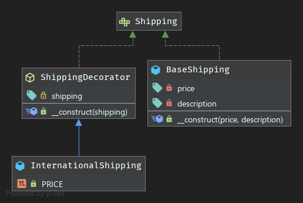

# Decorator Pattern

**Definition**
```
The decorator pattern is a design pattern that allows behavior to be added to an individual object, dynamically, 
without affecting the behavior of other objects from the same class.
```

***Why use decorator pattern?***
- The decorator pattern leverage SRP and OCP principles.
- Extending objects without bloating the code.
- Making code reusable and composable.
- Avoiding vertical inheritance.

***Disadvantages***
- Object construction becomes more complex
- Does not work well for objects with a large public API
- Difficulty to access the real concrete object

### UML

